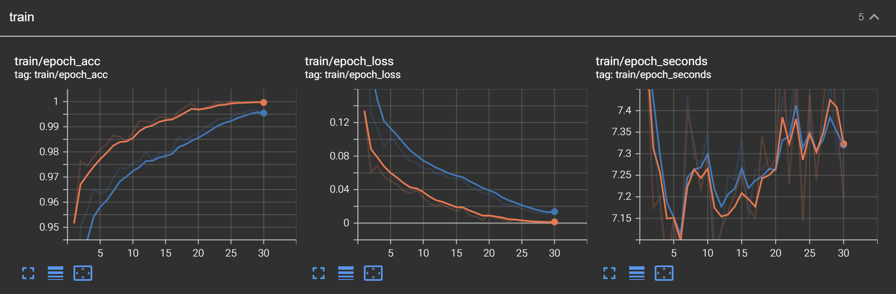
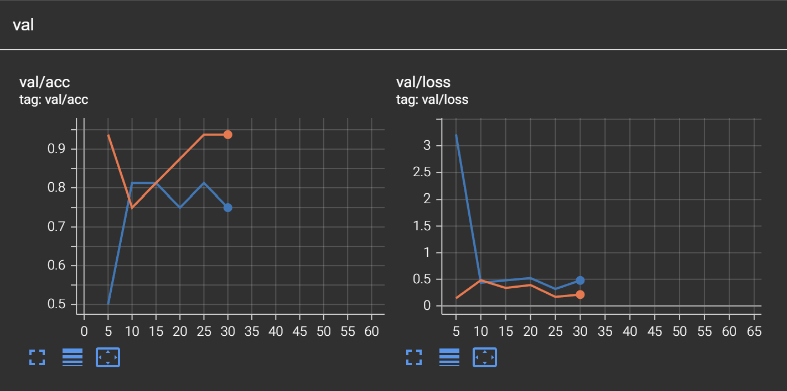
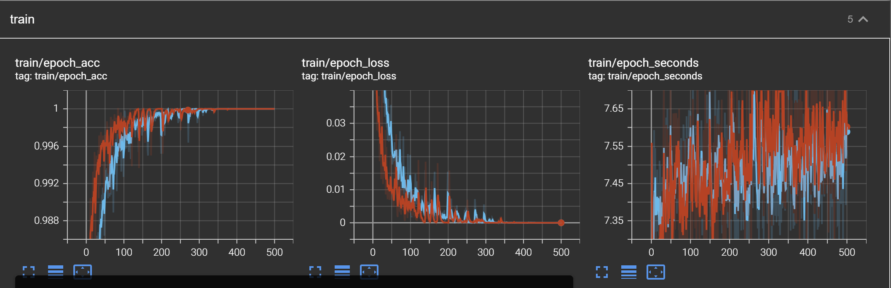
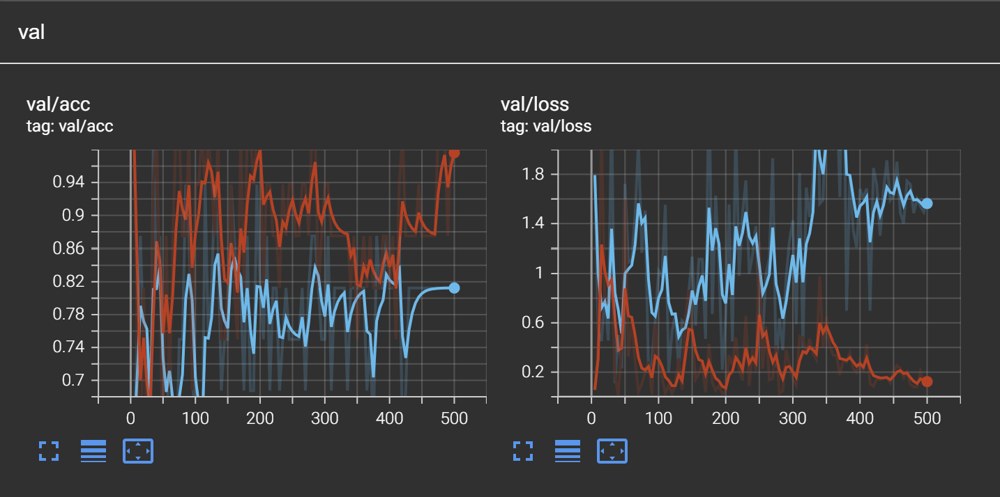
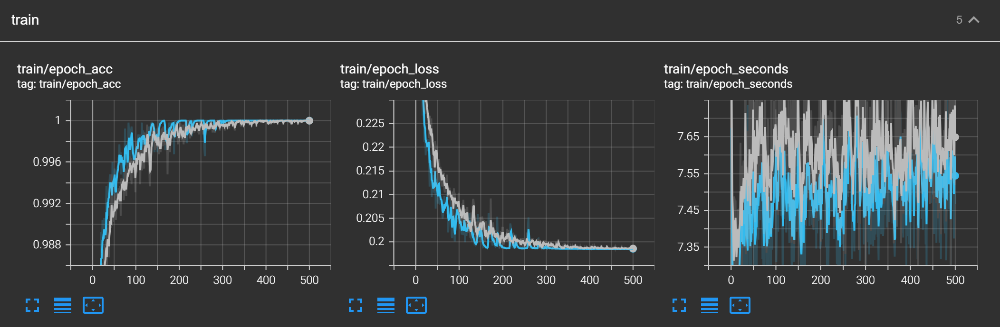
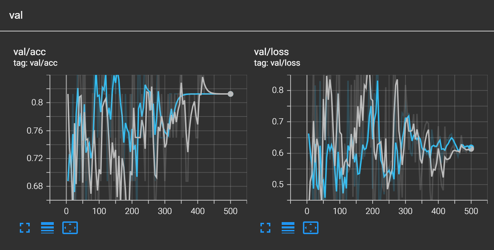

# CAP 5516 Programming Assignment #1

**Name:** Patrick Kwon  
**UCF NID:** yo564250  
**Course:** CAP 5516 - Medical Image Computing  
**Semester:** Spring 2026  
**Due Date:** March 1, 2026, 11:59 PM EST
**Code Repository:** [Assignment1-CAP5516](https://github.com/yj7082126/Assignment1-CAP5516)

## 1. Experimental Setup

### 1.1 Dataset Description

**Dataset:** Chest X-Ray Images (Pneumonia)  
**Source:** https://www.kaggle.com/paultimothymooney/chest-xray-pneumonia

- Total images: 5,863 JPEG images
- Classes: `NORMAL`, `PNEUMONIA`
- Patient population: pediatric chest X-rays
- Provided split: `train`, `val`, `test`

### 1.2 Hardware and Software

- GPU: `NVIDIA RTX A5000`
- Framework: `PyTorch`
- Logging: `TensorBoard`
- Environment details: `Python 3.10 / CUDA 12.1 / PyTorch 2.4.1`

### 1.3 Model

- Backbone: `ResNet-18`
- Output classes: `2`


## 2. Experiment 1 : 30 epoch setup

### 2.1 Implementation Details

| Hyperparameter | Task 1.1 Scratch | Task 1.2 Fine-tune |
|---|---:|---:|
| Epochs | 30 | 30 |
| Batch size | 64 | 64 |
| Base learning rate | 1e-3 | 1e-3 |

We use a CosineAnnealingLR throughout the training.
All validations and checkpoint saves were made every 5 epochs. The checkpoint with best validation accuracy and the last checkpoint are saved.

### 2.2 Training and Validation Loss Curves




**Figure 1.** Training and validation loss curves for ResNet-18 trained from scratch. Blue = Scratch, Orange = Finetuned. It can be observed that the finetuned version performs better than scratch, for both accuracy and loss.

### 2.3 Testing Performance

| Metric | Task 1.1 Scratch (best) | Task 1.1 Scratch (last) | Task 1.2 Fine-tune (best) | Task 1.2 Fine-tune (last) |
|---|---|---|---|---:|
| Test loss | 0.6561 | 1.3939 | 0.3324 | 1.2600 |
| Test accuracy | 0.8365 | 0.7692 | 0.9199 | 0.8317 |
| NORMAL accuracy | 0.5940 | 0.3889 | 0.8248 | 0.5556 |
| PNEUMONIA accuracy | 0.9821 | 0.9974 | 0.9769 | 0.9974 |

### 2.4 Example ailure Cases


**Figure 2.** Example failure case : test/PNEUMONIA/person154_bacteria_728.jpeg. Predicted as NORMAL despite being PNEUMONIA.

## 3. Experiment 2 : 500 epoch setup

### 3.1 Implementation Details

| Hyperparameter | Task 1.1 Scratch | Task 1.2 Fine-tune |
|---|---:|---:|
| Epochs | 500 | 500 |
| Batch size | 64 | 64 |
| Base learning rate | 1e-3 | 1e-3 |

We use a CosineAnnealingLR throughout the training.
All validations and checkpoint saves were made every 5 epochs. The checkpoint with best validation accuracy and the last checkpoint are saved.

### 3.2 Training and Validation Loss Curves




**Figure 3.** Training and validation loss curves for ResNet-18 trained from scratch. Sky Blue = Scratch, Red = Finetuned. It can be observed that the finetuned version performs better than scratch, for both accuracy and loss.

### 3.3 Testing Performance

| Metric | Task 1.1 Scratch (best) | Task 1.1 Scratch (last) | Task 1.2 Fine-tune (best) | Task 1.2 Fine-tune (last) |
|---|---|---|---|---:|
| Test loss | 0.9944 | 3.1254 | 0.3920 | 3.7072 |
| Test accuracy | 0.7869 | 0.8285 | 0.9087 | 0.8333 |
| NORMAL accuracy | 0.4487 | 0.5513 | 0.7650 | 0.5641 |
| PNEUMONIA accuracy | 0.9897 | 0.9949 | 0.9949 | 0.9649 |

### 3.4 Example Failure Cases


**Figure 4.** Example failure cases : Predicted as NORMAL despite being PNEUMONIA.

## 4. Experiment 3 : 500 epoch setup, with more training strategies (All Finetunbe)

### 4.1 Implementation Details

We add additional techniques such as warmup epochs, label smoothing, and data augmentation.
We compare between the session without data augmentation (Option 1) and with data augmentation (Option 2).

| Hyperparameter | Vanilla Finetune | Option 1 | Option 2 |
|---|---|---|---:|
| Epochs | 500 | 500 | 500 |
| Batch size | 64 | 64 | 64 |
| Base learning rate | 1e-3 | 1e-3 | 1e-3 |
| Weight decay | 1e-4 | 1e-4 | 1e-4 | 
| Warmup epochs | 0 | 5 | 5 |
| Label smoothing | 0 | 0.1 | 0.1 |
| Xavier init | False | True | True |
| Random erasing prob | 0.0 | 0.0 | 0.25 |
| Cutout prob | 0.0 | 0.0 | 0.5 |

We use a CosineAnnealingLR throughout the training, except for cases with Warmup epochs, which we use a LinearLR for the warmup epochs.
All validations and checkpoint saves were made every 5 epochs. The checkpoint with best validation accuracy and the last checkpoint are saved.

### 4.2 Training and Validation Loss Curves




**Figure 3.** Training and validation loss curves. Silver = Option 1. Sky Blue = Option 2.

### 4.3 Testing Performance

| Metric | Vanilla Fine-tune (best) | Vanilla Fine-tune (last) | Option 1 (best) | Option 1 (last) | Option 2 (best) | Option 2(last) |
|---|---|---|---|---|---|---:|
| Test loss | 0.3920 | 3.7072 | 0.5844 | 0.5467 | 0.7567 | 0.5413 |
| Test accuracy | 0.9087 | 0.8333 | 0.8013 | 0.8189 | 0.7099 | 0.8157 |
| NORMAL accuracy | 0.7650 | 0.5641 | 0.4786 | 0.5256 | 0.2308 | 0.5214 |
| PNEUMONIA accuracy | 0.9949 | 0.9649 | 0.9949 | 0.9949 | 0.9974 | 0.9923 |

### 4.4 Example Failure Cases


**Figure 4.** Example failure cases : Predicted as NORMAL despite being PNEUMONIA.

## 6. Conclusion and Discussion

The fine-tuned ResNet-18 consistently performed better than the scratch model. In the 30-epoch setup, fine-tuning improved test accuracy from `0.8365` to `0.9199`, and in the 500-epoch setup from `0.7869` to `0.9087`. The curves also show faster convergence with pretraining.

The 500-epoch runs suggest overfitting, since the last checkpoints were often worse than the best checkpoints, especially in test loss. Another clear pattern is that `NORMAL` was harder than `PNEUMONIA`, with pneumonia accuracy staying very high across almost all experiments.

The main failure cases were pneumonia images predicted as normal. The extra Bag-of-Tricks settings in experiment 3 did not improve results over the vanilla fine-tuned baseline, so pretraining was the most useful factor in this project.

Main takeaway: `ImageNet pretraining was more beneficial than training from scratch or adding extra tricks, and best-checkpoint selection was critical to avoid overfitting.`

## 7. Reproducibility

### 7.1 Code

- Training script: [train_resnet18.py](train_resnet18.py)
- Testing script: [test_resnet18.py](test_resnet18.py)
- Dataset download script: [download_kaggle_dataset.py](download_kaggle_dataset.py)
- Github Repository: [Assignment1-CAP5516](https://github.com/yj7082126/Assignment1-CAP5516)

### 7.2 Run Commands

```bash
# Train from scratch
python3 train_resnet18.py --mode scratch

# Fine-tune from ImageNet pretrained weights
python3 train_resnet18.py --mode finetune

# Test a saved checkpoint
python3 test_resnet18.py --checkpoint outputs/<run_name>/checkpoints/best.pt

# Launch TensorBoard
tensorboard --logdir outputs
```

* Once the [download_kaggle_dataset.py](download_kaggle_dataset.py) is executed, the folder should look like the following:

```
datasets/chest-xray-pneumonia/chest_xray
├── test
├───── NORMAL
├───── PNEUMONIA
├── train
├───── NORMAL
├───── PNEUMONIA
├── val
├───── NORMAL
├───── PNEUMONIA
```
* All training logs will be stored on ```outputs/```
* All test results will be stored on ```test_results/```